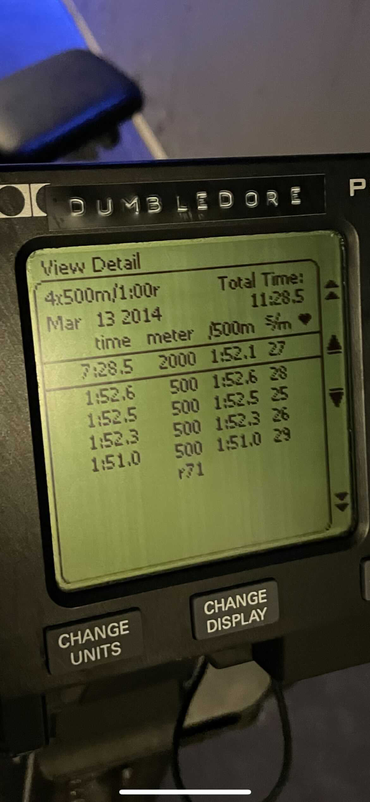
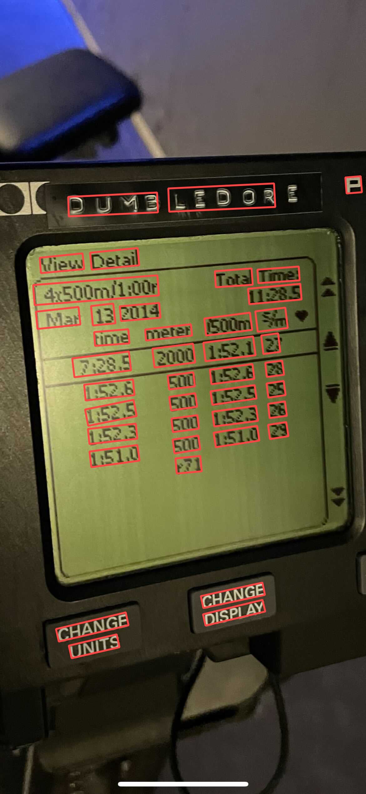
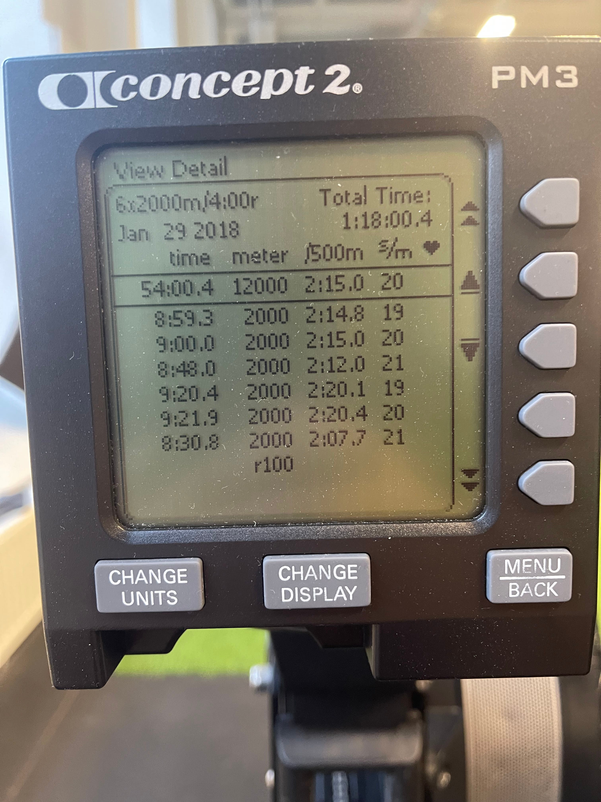
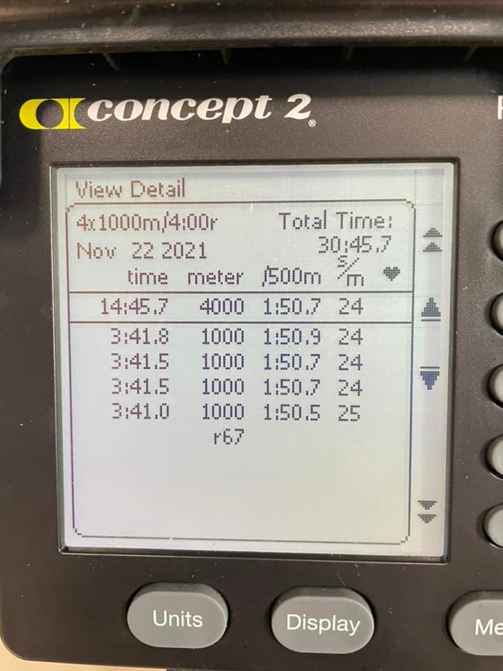
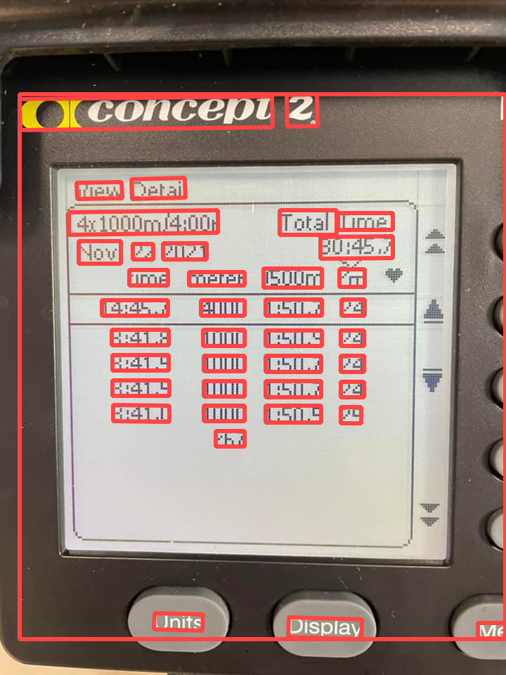
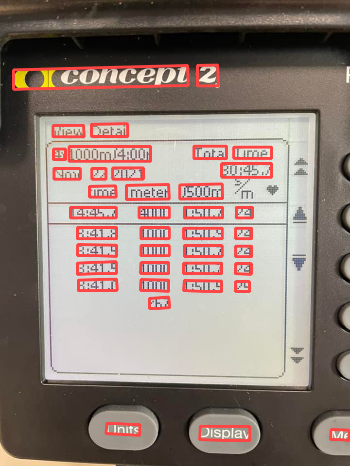
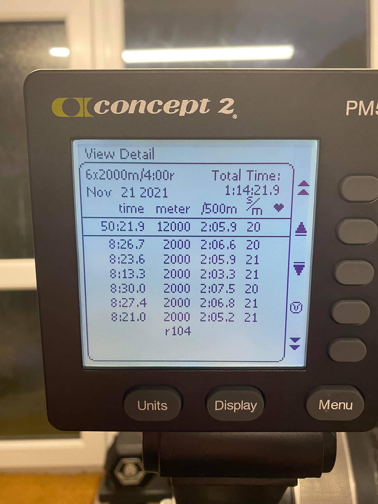
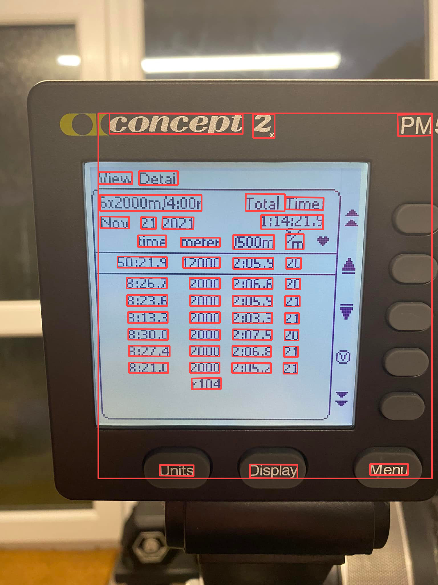
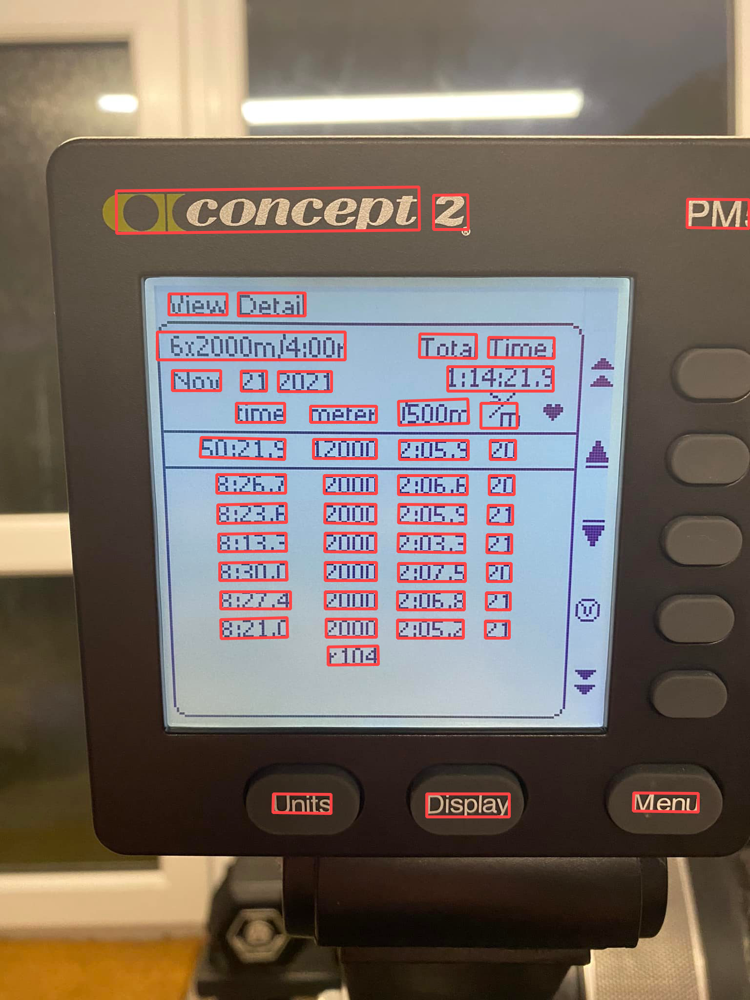

### Background

Some comparisons for OCR detection on Concept2 rowing machines between Cloud Vision and Flutter MLKit.

### Requirements

GCP credentials needs to be available on the path. See https://cloud.google.com/vision/docs/before-you-begin

### Build

````
$ go build 
````

### Examples

```
$ ./mlkit-vs-cloud-vision vision -image images/example_1.jpg -out output/example_vision_1.jpg
$ ./mlkit-vs-cloud-vision vision -image images/example_2.jpg -out output/example_vision_2.jpg
$ ./mlkit-vs-cloud-vision vision -image images/example_3.jpeg -out output/example_vision_3.jpeg
$ ./mlkit-vs-cloud-vision vision -image images/example_4.jpeg -out output/example_vision_4.jpeg
```

#### Areas from cloud vision

Example for drawing identified areas (coordinates from Flutter and MlKit):

```
$ ./mlkit-vs-cloud-vision draw -image images/example_1.jpg -out output/example_mlkit_1.jpg -coords coords/coords1.txt
$ ./mlkit-vs-cloud-vision draw -image images/example_2.jpg -out output/example_mlkit_2.jpg -coords coords/coords2.txt
$ ./mlkit-vs-cloud-vision draw -image images/example_3.jpeg -out output/example_mlkit_3.jpeg -coords coords/coords3.txt
$ ./mlkit-vs-cloud-vision draw -image images/example_4.jpeg -out output/example_mlkit_4.jpeg -coords coords/coords4.txt
```

### Results

These are the result on the identified texts between Cloud Vision and Flutter MLKit. Only the content in on the Concept
2 rowing screen is counted.

| File   |      Cloud Vision      |  Flutter MLKit    |
|----------|:-------------: |---------------:   |
| example1.jpg | ~100% (*1) 👍        |    ~80% (*5) 👎        |
| example2.jpg | ~100% (*2) 👍        |    ~0%  (*6) 👎       |
| example3.jpg | ~100% (*3) 👍        |    ~90% (*7) 👎          |
| example4.jpg | ~100% (*4) 👍        |    ~90% (*8) 👎          |

1. Failed to detect `/` one "/500m" and "/" between "s/m".
2. Failed to detect s in "s/m".
3. Failed to detect s in "s/m".
4. Failed to detect `/` one "/500m" and "/" between "s/m".

The issues seem to be around detecting / and s/m.

5. Failed to detect a lot of content and some is wrong, for example r71 is detected as r31.
6. Nothing is detected in this image.
7. Failed to detect some numbers, seems that it has trouble see difference between 3 and B, like 3.41.8 is seen as
   B.41.8.
8. Numbers are seen very differently, for example 2:03.3, 2:075, 2:06,8, etc.

### Conclusion

Using MLKit is not an option in this case, it's not possible to get a good result.

#### Example 1( Original, Cloud Vision, MLKit)

|  Name | Original   | Cloud Vision  | MLKit  |
|---|---|---|---|
|  Example 1 |   |  |   |
|  Example 2 |   |   |   |
|  Example 3 |   |   |   |
|  Example 4 |   |   |   |
